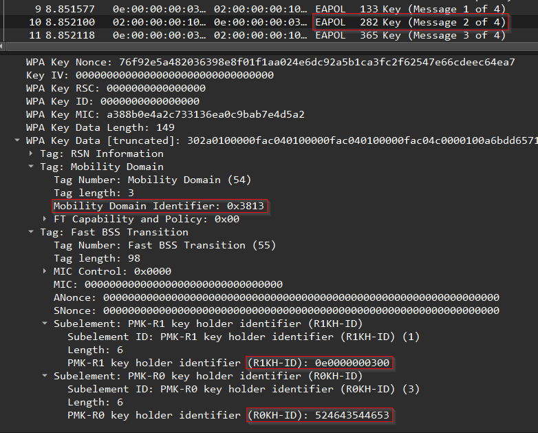

# FT-Crack
**FT-Crack** is a Python script for cracking WPA handshakes that have FT-PSK enabled.

<p align="center">
  
</p>

Traditonally, WPA/WPA2 handshake "crackers" have used the same algorithms in order to calculate the values necessary to determine whether or not a password is correct. However, when [fast BSS transition](https://en.wikipedia.org/wiki/IEEE_802.11r-2008) is enabled for an access point, the algorithms used are no longer the same. The standard tools one might use to crack a WPA/WPA2 handshake (Hashcat, JtR, aircrack) don't currently support fast transition: and that's where **FT-Crack** steps in.

## Usage
**FT-Crack** takes a hash in the format of:

`WPA*04*MIC*MAC_AP*MAC_CLIENT*ESSID*NONCE_AP*EAPOL_CLIENT*MESSAGEPAIR*MD-ID*R0KH-ID*R1KH-ID`

and a wordlist and attempts to crack the password. This is to keep the hash in line with the [proposal from ZerBea of hcxtools](https://github.com/hashcat/hashcat/issues/3887), where I got most of my inspiration for creating the tool. Currently it's designed to either read in a hash from the command line, or from a file, and supports only one hash at a time. If you are constructing your own hash from a capture file, ensure that the *EAPOL_CLIENT* portion has the MIC field zero'd out in the hash.
```
usage: ft-crack.py [-h] -w WORDLIST [-v] [-q] hashfile

Script to crack FT-PSK handshakes for WPA. Takes in a hash on the command line or from a file. Currently supports
single hash.

positional arguments:
  hashfile              File or string containing the hash to crack

options:
  -h, --help            show this help message and exit
  -w WORDLIST, --wordlist WORDLIST
                        File containing the wordlist to use
  -v, --verbose         Prints out addtional information while crack is running
  -q, --quiet           Flag to disable printing of extra information

```
...and that's pretty much it. It's meant to be simple, but effective.

## Creating the Hash
Calculating the correct MIC for an FT-PSK handshake requires a few addtional values: _R0KH-ID, R1KH-ID,_ and a _Mobility Domain Identifier (MDID)_. These values can all be found within the "WPA Key Data" field for the second EAPOL message during a 4-way handshake. Example:

<p align="center">
  
</p>

Otherwise, constructing the hash "by hand" requires the rest of the normal details: The MIC from the second EAPOL message, the MAC addresses of both the access point and the client, the nonce provided from the access point, and the entire second EAPOL message in the 4-way handshake (with the MIC field set to be all zeroes). From the example image, the hash would end up looking like:

`WPA*04*a388b0e4a2c733136ea0c9bab7e4d5a2*0e0000000300*020000001000*52464354465f5750415f313172775f3247*404a3a2e777dc1a4c04539b647d58f3b97565bfabc48fe3905e3b2c31fda12db*010300f402010b0000000000000000000176f92e5a482036398e8f01f1aa024e6dc92a5b1ca3fc2f62547e66cdeec64ea70000000000000000000000000000000000000000000000000000000000000000000000000000000000000000000000000095302a0100000fac040100000fac040100000fac04c0000100a6bdd6571a34c9afe11103386e0948cf000fac06360313380037620000000000000000000000000000000000000000000000000000000000000000000000000000000000000000000000000000000000000000000000000000000000000000000000000000000000000000000001060e00000003000306524643544653*02*1338*524643544653*0e0000000300`

I made the choice to have the _MDID_ portion of the hash be in the order that the bytes are within a capture file, not the order that is displayed in the GUI- which means in the example, instead of `3813` my hash has `1338`. As long as all these values are correct and you have an appropriate wordlist, the script should be able to crack it.

## Additional Information
### What is FT-PSK?
>*“IEEE 802.11r-2008 or fast BSS transition (FT), is an amendment to the IEEE 802.11 standard to permit continuous connectivity aboard wireless devices in motion, with fast and secure client transitions from one Basic Service Set (abbreviated BSS, and also known as a base station or more colloquially, an access point) to another performed in a nearly seamless manner. It was published on July 15, 2008. IEEE 802.11r-2008 was rolled up into 802.11-2012.[1] The terms handoff and roaming are often used, although 802.11 transition is not a true handoff/roaming process in the cellular sense, where the process is coordinated by the base station and is generally uninterrupted.”*

Effectively, "fast transition" is a way of configuring an access point to allow roaming within an environment. The idea was that if the client didn't have to re-prove that it knew the PSK used every time, it would improve performance. For us, this just means that they moved from a value derived from the PSK to values derived from values derived from the PSK.

### Why make this?
Hopefully soon, there will be a whole blog post going into more detail on the "why" and the "how". For now, the short story is that I made it in an attempt to be prepared for DEFCON32. While doing some research into possible WiFi attacks and methods, I ended up being unable to find a tool that could crack an FT-PSK handshake. It seemed like the idea had been brought up, but no one had supported it yet. So, I made one.

### Why doesn't this work on my hash/file/handshake/XYZ?
That's a good question! This isn't a robust tool as much as it is a simple script. That being said, it hasn't been _thoroughly_ tested in any rigorous manner, and I can't guarantee it will work in every possible scenario. It was created and tested using the data that I had available to me at the time, but as far as I can tell (until told otherwise) it _should_ work, as long as you have the correct password in a given wordlist and your hash is formatted properly. If it doesn't (and you are positive that you have an FT-PSK handshake), please feel free to let me know, and I can see if I can fix whatever seems to be the problem.

## Plans for the Future
Currently, I don't have any big plans for FT-Crack. It was a simple script that I created for DEFCON32, and I fully expect that the larger, more dedicated, hash cracking tools will eventually support this. In the meantime, I figured it would be a nice way to fill the void for the community for anyone else out there that runs into this same type of problem and needs a solution.

Until then, I plan on maintaining this as best as I can, and fixing any issues that may arise. Some functionality might be added in the future to add support for parsing capture files to create hashes on-the-fly, or support for multiline hashfiles, but that's all still TBD depending on how long this sits before FT-PSK ends up being supported elsewhere.
